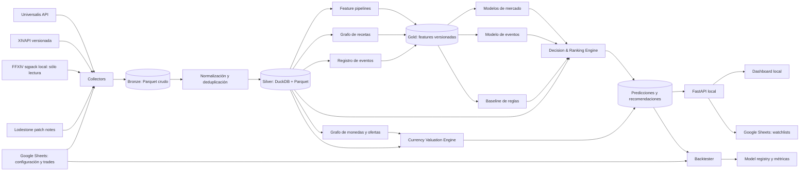

# Arquitectura — FFXIV Gil Intelligence

Estado: diseño inicial  
Fecha: 2026-08-09  
Alcance inicial: un Data Center configurable, operación manual dentro de FFXIV

## 1. Objetivo

Construir un sistema local-first que transforme datos públicos del Market Board y datos estáticos del juego en recomendaciones explicables para ganar gil.

El sistema debe responder cinco preguntas:

1. ¿Qué objetos presentan una oportunidad ahora?
2. ¿Conviene comprar, revender, craftear, recolectar o esperar?
3. ¿Cuánto capital asignar sin saturar el mercado?
4. ¿Qué objetos podrían aumentar su demanda alrededor de un parche o expansión?
5. ¿Qué bienes se compran con cada moneda o token y cuánto gil actual devuelve cada conversión?

El producto entrega apoyo a decisiones. Nunca interactúa con el cliente del juego ni ejecuta compras, ventas, viajes, crafting o gathering.

## 2. Principios y límites

### Principios

- **Local-first:** datos crudos, entrenamiento y API corren en el PC.
- **Google como interfaz:** Sheets recibe recomendaciones y operaciones manuales; Drive puede respaldar artefactos seleccionados.
- **Datos por niveles:** agregados para todo el mercado; detalle sólo para candidatos.
- **Explicable:** cada recomendación incluye motivos, incertidumbre y frescura de datos.
- **Primero baseline, luego ML:** las reglas y estadísticas deben ser útiles antes de entrenar modelos.
- **Backtesting temporal:** ninguna feature puede usar información que no existía al emitir la predicción.
- **Configuración, no hardcode:** región, Data Center, world, capital, jobs y tolerancia al riesgo son parámetros.

### Fuera de alcance

- Automatizar el cliente, clicks, compras, ventas o gameplay.
- Leer memoria, paquetes o archivos del juego durante una sesión.
- Plugins de cliente o recolección no autorizada.
- RMT o conversión de gil a dinero real.
- Guardar nombres de compradores, retainers o crafters cuando no aportan al modelo.
- Replicar por completo la infraestructura de Universalis.

## 3. Casos de uso

### A. Radar diario

Ordena objetos por retorno esperado ajustado por liquidez, riesgo, capital y frescura.

### B. Arbitraje cross-world

Detecta diferencias de precio dentro del Data Center y descarta spreads que no compensan baja demanda, competencia o datos antiguos.

### C. Craft-or-buy

Recorre el grafo de recetas para calcular el costo mínimo de producir un objeto y sus componentes, comparándolo con la compra directa.

### D. Expansion Watch

Antes de un evento, estima la probabilidad de aumento de precio y volumen. Después de publicar datos del parche, identifica dependencias nuevas y reacciona a señales tempranas.

### E. Currency Exchange

Cataloga todas las ofertas conocidas de monedas, scrips, seals y tokens. Para cada resultado tradeable calcula su valor actual en el Market Board y los gil netos por unidad de moneda. Es determinista: no intenta predecir el precio futuro.

### F. Portafolio personal

Usa capital disponible, inventario, jobs, restricciones y operaciones pasadas para proponer cantidades y medir el resultado real.

## 4. Vista general



## 5. Componentes

### 5.1 Collectors

Procesos idempotentes con reintentos, backoff, cache HTTP y watermarks.

#### Universalis

- `marketable`: catálogo de IDs comercializables.
- `aggregated`: mínimo, mediana, compra reciente, precio promedio y velocidad de venta.
- `history`: ventas históricas e incrementales.
- `currently shown`: listings individuales sólo para candidatos.
- `worlds` y `data-centers`: topología del mercado.
- `tax-rates`: si aporta a cálculos configurados.

Política inicial:

| Universo | Datos | Frecuencia normal | Frecuencia patch-day |
|---|---|---:|---:|
| Todos los objetos | Agregados | 6 horas | 1 hora |
| Top 1.000 candidatos | Agregados | 30 minutos | 10 minutos |
| Top 500 candidatos | Listings | 60 minutos | 10–15 minutos |
| Ventas nuevas | Historial incremental | 1 hora | 10–15 minutos |

Las frecuencias se ajustan a la frescura real de la fuente. No se repite una carga si `lastUploadTime` no cambió.

#### Datos estáticos locales

- Lumina lee las sheets del `sqpack` instalado en modo sólo lectura.
- La versión de `ffxivgame.ver` identifica cada snapshot.
- No hay tráfico de red ni rate limits; se extrae una vez por parche.
- El extractor no se conecta al proceso, memoria, paquetes de red ni UI del juego.
- Las reglas que resuelven placeholders de monedas se guardan y prueban por versión.

#### XIVAPI

- Items, categorías, niveles, flags HQ y vendor price.
- Recipes y sus ingredientes.
- Jobs y datos estáticos relacionados.
- Tiendas e intercambios de las sheets disponibles, incluyendo familias como `SpecialShop`, Grand Company shops, inclusion/collectables shops, FC shops, disposal/lottery exchanges, conversiones de tomestones y tiendas de gil.
- Versiones de juego para comparar cambios entre parches.

Se usa como alternativa y contraste de schema. Se guarda la versión y el schema pin usado en cada extracción. El pipeline normaliza ambos orígenes al mismo modelo y registra su procedencia.

#### Lodestone

- Calendario oficial de expansiones y parches.
- Texto y fecha de publicación de patch notes.
- Etiquetas manuales de tipo de evento: expansión, raid, crafting, housing, relic, etc.

No se usa el contenido de una nota antes de su timestamp real de publicación durante backtesting.

#### Google Sheets

Entrada manual:

- Capital disponible.
- World principal y Data Center.
- Jobs y capacidades de crafting/gathering.
- Inventario relevante.
- Compras y ventas realizadas.
- Riesgo y horizonte preferidos.

El conector se abstrae detrás de una interfaz para poder comenzar con CSV y añadir OAuth/Sheets API después.

### 5.2 Almacenamiento

#### Bronze

Respuestas crudas comprimidas y particionadas:

```text
data/bronze/{source}/{entity}/date=YYYY-MM-DD/hour=HH/*.parquet
```

Retención inicial: 90 días. Después se conserva sólo información necesaria para reproducibilidad o auditoría.

#### Silver

Datos limpios, tipados y deduplicados. DuckDB sirve como catálogo y motor analítico; Parquet conserva tablas grandes.

#### Gold

Features calculadas con un `as_of_timestamp` explícito. Cada dataset registra:

- Versión del código de features.
- Ventana temporal.
- Fuentes y watermarks.
- Fecha máxima visible para el modelo.

### 5.3 Grafo de recetas

Grafo dirigido donde un producto apunta a sus ingredientes. Debe soportar:

- Recetas anidadas.
- Cantidades y yield.
- HQ/NQ cuando corresponda.
- Compra a NPC como costo alternativo.
- Materiales no comercializables.
- Costo mínimo recursivo con prevención de ciclos.
- Impacto de receta nueva: cuántas rutas nuevas consumen un objeto antiguo.

### 5.4 Grafo de monedas y ofertas

Dominio determinista independiente de ML. Una oferta contiene:

- Una tienda y, cuando esté disponible, NPC/ubicación.
- Cero o más requisitos de acceso.
- Uno o más componentes de costo.
- Uno o más productos y cantidades recibidas.
- Versión del juego en que fue observada.

Los costos no se limitan a monedas formales. Un componente puede ser gil, una moneda, un item-token u otro activo definido por el juego. Esto permite representar Poetics, seals, scrips, monedas tribales, raid tokens e intercambios mixtos con el mismo modelo.

Para cada producto se conserva aunque no sea tradeable. La capa de valoración lo clasifica como:

- `DIRECT_MB`: puede comprarse y venderse directamente en el Market Board.
- `UNTRADEABLE`: existe la conversión, pero el resultado no puede venderse.
- `INDIRECT`: requiere otra transformación; fuera del cálculo directo inicial.
- `UNKNOWN`: faltan datos suficientes y requiere revisión.

El cálculo no predictivo muestra como mínimo:

```text
gross_gil_per_currency = current_market_price × output_quantity / currency_quantity
net_gil_per_currency   = (current_market_price × output_quantity - configured_fees - other_costs) / currency_quantity
```

Se publican varias referencias de precio, sin mezclarlas:

- Listing mínimo actual.
- Mediana de listings.
- Precio promedio reciente de ventas.

Toda valoración incluye `market_data_as_of`, world/DC, moneda consultada, costos adicionales y frescura. En ofertas con múltiples monedas no se atribuye todo el valor a una sola: se muestra la canasta completa o una valoración residual explícita.

La especificación y los controles de exhaustividad están en [CURRENCY_EXCHANGE.md](CURRENCY_EXCHANGE.md).

### 5.5 Registro de eventos

Tabla canónica de eventos económicos:

```text
event_id
event_type
patch_version
announcement_at
preliminary_notes_at
full_notes_at
release_at
event_tags
```

Permite construir ejemplos comparables alrededor de cada evento usando ventanas `T-90` a `T+30`.

### 5.6 Feature pipelines

#### Mercado

- Retornos de precio: 1h, 6h, 1d, 3d, 7d y 30d.
- Volumen y velocidad de venta.
- Volatilidad, drawdown y estabilidad de spread.
- Listings, unidades disponibles y profundidad por tramo de precio.
- Diferencia world/DC/region.
- Edad del último dato y densidad de uploads.
- Concentración de stacks y sensibilidad a cantidades.
- Días estimados para liquidar una posición.

#### Item y receta

- Categoría, nivel, equipabilidad, HQ y stack size.
- Crafteable, gatherable, vendor-available o limitado.
- Profundidad y centralidad en el grafo de recetas.
- Cantidad de productos finales que dependen del material.
- Cambio de dependencias entre versiones del juego.

#### Eventos

- Tipo de evento y distancia temporal.
- Reacción histórica del objeto y su categoría.
- Aceleración pre-evento de precio, volumen y reducción de oferta.
- Similitud con objetos afectados en eventos previos.
- Presencia en recetas nuevas, directa e indirecta.

#### Usuario

- Capital libre.
- Inventario y precio de entrada.
- Jobs disponibles.
- Horizonte y tolerancia al riesgo.
- Resultados reales por tipo de recomendación.

## 6. Modelo de datos lógico

### Dimensiones

- `dim_item`
- `dim_world`
- `dim_data_center`
- `dim_game_version`
- `dim_recipe`
- `bridge_recipe_ingredient`
- `dim_asset`
- `dim_currency`
- `dim_shop`
- `dim_shop_offer`
- `bridge_offer_cost`
- `bridge_offer_reward`
- `bridge_offer_requirement`
- `dim_event`

### Hechos de mercado

- `fact_market_aggregate_snapshot`
- `fact_listing_snapshot`
- `fact_sale`
- `fact_data_freshness`

### ML y decisión

- `feature_market_item_asof`
- `feature_item_event_asof`
- `model_run`
- `prediction`
- `recommendation`
- `backtest_result`
- `currency_market_valuation`
- `shop_coverage_audit`

### Usuario

- `user_profile`
- `user_inventory_snapshot`
- `user_trade`
- `user_recommendation_outcome`

### Identidad y deduplicación

- Snapshots: `scope + world + item_id + observed_at + data_version`.
- Ventas: hash estable de los campos no personales disponibles, tolerando colisiones/repeticiones documentadas.
- Listings: identidad efímera; se comparan snapshots y no se asume que un listing desaparecido fue vendido.
- No se persisten nombres de compradores o retainers.

## 7. Estrategia de modelos

### Etapa 0: baseline determinista

Debe producir recomendaciones antes de tener suficiente historial.

```text
expected_net_profit
× sell_probability
× data_confidence
÷ price_risk
÷ expected_days_to_exit
```

Filtros duros:

- Capital máximo por objeto.
- Volumen mínimo.
- Frescura máxima.
- Ganancia neta mínima.
- Máximo porcentaje del volumen diario que podemos comprar.

### Etapa 1: modelos de mercado normal

Modelos tabulares con boosting como primera elección:

- Clasificación: probabilidad de venta suficiente en 1/3/7 días.
- Regresión cuantílica: rango de precio futuro, no sólo un punto.
- Regresión: volumen futuro esperado.
- Clasificación: riesgo de caída por debajo del precio de entrada.

No se modela una probabilidad exacta de vender *nuestro listing* porque la fuente no permite observarlo de forma confiable. Se estima liquidez a nivel de mercado.

### Etapa 2: modelo de impacto de eventos

Unidad de entrenamiento: `item × evento × timestamp de corte`.

Targets principales:

- Probabilidad de que el precio mediano aumente al menos un umbral configurable.
- Probabilidad de que el volumen se multiplique durante `T+1..T+7`.
- Máximo uplift y drawdown durante `T+1..T+14`.
- Tiempo hasta el máximo y tiempo de normalización.

Se entrena con expansiones y parches importantes. Dado que hay pocas expansiones con cobertura buena, las expansiones no se consideran muestras independientes suficientes; los parches aumentan el conjunto de eventos y el tipo de evento entra como feature.

### Etapa 3: patch-day nowcasting

Combina:

- Diferencias de recetas entre versiones.
- Señales de las primeras horas.
- Modelo de eventos.
- Reglas de disponibilidad y vendor price.

Emite predicciones sucesivas con `prediction_as_of` y nunca sobrescribe las anteriores.

## 8. Decision & Ranking Engine

Convierte predicciones en acciones sujetas a restricciones.

Acciones:

- `WATCH`
- `BUY_RESELL`
- `BUY_CROSS_WORLD`
- `CRAFT`
- `GATHER`
- `HOLD`
- `SELL`
- `AVOID`

Cada recomendación contiene:

```text
action
item_id
source_world
target_world
max_buy_price
target_sell_range
recommended_quantity
expected_net_profit_range
expected_exit_days
confidence
risk_flags
reason_codes
expires_at
model_version
data_as_of
```

La cantidad recomendada se limita por:

- Capital total y porcentaje máximo por posición.
- Unidades vendidas por día.
- Profundidad real de listings.
- Inventario actual.
- Correlación con otras posiciones de la misma categoría.

## 9. Backtesting y validación

### Cortes temporales

- Entrenamiento y validación siempre avanzan en el tiempo.
- Evaluación leave-one-event-out para el modelo de parches.
- Una expansión completa se reserva como test cuando los datos lo permitan.

### Prevención de leakage

- Toda tabla de features exige `as_of_timestamp`.
- Recetas nuevas sólo entran después de estar disponibles en la versión correspondiente.
- Patch notes sólo entran después de su publicación.
- Agregados se recalculan desde hechos visibles al corte, no desde resúmenes actuales.

### Métricas

ML:

- Precision@K y Recall@K.
- PR-AUC para eventos raros.
- Calibration error.
- Pinball loss para cuantiles.

Económicas:

- Gil neto esperado y realizado.
- Retorno sobre capital.
- Máximo drawdown.
- Días de capital inmovilizado.
- Tasa de liquidación dentro del horizonte.
- Ganancia frente a baseline simple.

El criterio principal es económico, no sólo predictivo.

## 10. Interfaces

### API local

FastAPI expone inicialmente:

- `GET /health`
- `GET /recommendations`
- `GET /items/{item_id}/analysis`
- `GET /events/{event_id}/watchlist`
- `GET /currencies/search`
- `GET /currencies/{currency_id}/offers`
- `GET /currencies/{currency_id}/best-conversions`
- `GET /shops/coverage`
- `POST /portfolio/trades/import`
- `POST /jobs/refresh`
- `GET /jobs/{job_id}`

### Dashboard local

Streamlit para exploración:

- Radar diario.
- Expansion Watch.
- Item explorer con historial y explicación.
- Craft-or-buy.
- Portafolio y backtests.

### Google Sheets

Libro propuesto:

- `CONFIG`
- `DAILY_RADAR`
- `EXPANSION_WATCH`
- `CURRENCY_CONVERTER`
- `SHOP_COVERAGE`
- `CRAFT_OR_BUY`
- `INVENTORY`
- `TRADES`
- `PERFORMANCE`

Sheets no almacena el dataset crudo. Sólo recibe resultados acotados e inputs humanos.

## 11. Operación y observabilidad

### Scheduler

Un CLI idempotente ejecutado por Windows Task Scheduler. Cada job puede correr también manualmente:

```text
collect-market
collect-history
collect-game-data
build-shop-catalog
build-features
value-currencies
score-market
score-event
publish-sheets
backtest
```

No se introduce un orquestador pesado hasta necesitarlo.

### Controles

- Logs estructurados JSON.
- Tabla `ingestion_watermark` por fuente/scope.
- Métricas de latencia, errores, filas nuevas y frescura.
- Reintentos con exponential backoff y jitter.
- Rate limit deliberadamente inferior al máximo de la API: una conexión y 1 request/s por defecto para Universalis.
- Circuit breaker si la fuente devuelve errores repetidos.
- Alertas por datos estancados, schema drift y recomendaciones vacías.

### Reproducibilidad

- Configuración versionada.
- Seeds fijas en entrenamiento.
- Artefactos con hash de features, código y datos.
- Predicciones append-only.
- Model registry local antes de considerar un servicio externo.

## 12. Seguridad y cumplimiento

- Sólo APIs públicas, contenido oficial, entradas manuales y lectura estática local explícitamente configurada.
- Ninguna integración con el proceso o memoria de FFXIV.
- Ninguna modificación de archivos del juego.
- Ninguna acción automática dentro del juego.
- Secrets en variables de entorno o Windows Credential Manager, nunca en Git.
- OAuth de Google con scopes mínimos.
- Datos personales excluidos o hasheados sólo si fueran imprescindibles.
- User-Agent identificable y uso respetuoso de rate limits.

## 13. Stack propuesto

| Área | Elección inicial |
|---|---|
| Lenguaje | Python 3.12+ |
| HTTP | httpx |
| Validación | Pydantic |
| Transformación | Polars |
| Analítica local | DuckDB |
| Archivos | Parquet + Zstandard |
| ML tabular | LightGBM o CatBoost |
| Optimización | OR-Tools cuando sea necesario |
| API | FastAPI |
| UI local | Streamlit |
| Tests | pytest |
| Calidad | Ruff + type checker |
| Scheduling | CLI + Windows Task Scheduler |
| Google | Sheets API mediante adapter opcional |

Las dependencias se fijarán en el scaffold; esta arquitectura no depende de una versión menor concreta.

## 14. Estructura del repositorio

```text
ffxiv_addon/
├─ apps/
│  ├─ api/
│  └─ dashboard/
├─ src/gil_intelligence/
│  ├─ collectors/
│  ├─ contracts/
│  ├─ storage/
│  ├─ transforms/
│  ├─ recipes/
│  ├─ events/
│  ├─ features/
│  ├─ models/
│  ├─ decision/
│  ├─ backtesting/
│  ├─ publishing/
│  └─ cli/
├─ configs/
├─ data/                 # gitignored
├─ models/               # gitignored salvo metadata
├─ tests/
│  ├─ unit/
│  ├─ integration/
│  └─ fixtures/
├─ docs/
│  ├─ ARCHITECTURE.md
│  └─ adr/
└─ pyproject.toml
```

## 15. Fases de construcción

### Fase 0 — Fundación

- Scaffold, configuración y contratos.
- DuckDB, particiones Parquet y migrations.
- CLI, logging, tests y health checks.

**Salida:** proyecto ejecutable sin datos reales.

### Fase 1 — Dataset de mercado

- Collectors de Universalis.
- Catálogo de XIVAPI.
- Snapshots agregados e historial incremental.
- Controles de frescura y deduplicación.

**Salida:** dataset confiable de un Data Center.

### Fase 2 — MVP útil sin ML

- Baseline de oportunidades.
- Arbitraje y liquidez.
- Dashboard local.
- Export a Google Sheets.

**Salida:** recomendaciones diarias explicables.

### Fase 3 — Currency Exchange

- Inventario versionado de todas las sheets de tiendas soportadas.
- Modelo genérico de ofertas, costos, recompensas y requisitos.
- Auditor de cobertura y cola de excepciones.
- Cruce con marketability y precios actuales de Universalis.
- Buscador por moneda y ranking de gil por unidad.

**Salida:** conversor completo, determinista y actualizado por parche.

### Fase 4 — Craft-or-buy

- Recipes versionadas.
- Grafo y costos recursivos.
- Acción `CRAFT` con margen neto.

**Salida:** comparación comprar/craftear/recolectar.

### Fase 5 — ML de mercado

- Feature store as-of.
- Modelos de precio, volumen y riesgo.
- Backtester económico.
- Ranking híbrido baseline + ML.

**Salida:** recomendaciones calibradas y evaluadas.

### Fase 6 — Expansion Watch

- Registro histórico de eventos.
- Datasets item-event.
- Modelo pre-evento.
- Comparador de versiones y patch-day nowcasting.

**Salida:** watchlist antes del evento y alertas tempranas al publicarse datos nuevos.

### Fase 7 — Portafolio personal

- Inventario, trades y outcomes.
- Asignación de capital con restricciones.
- Aprendizaje de preferencias y rendimiento personal.

**Salida:** cantidades personalizadas y medición de gil realizado.

## 16. Decisiones iniciales

1. **Un Data Center primero.** Reduce costo y permite validar valor antes de ampliar.
2. **Agregados para cobertura; listings para profundidad selectiva.** Evita varios TB innecesarios.
3. **DuckDB + Parquet.** Suficiente para decenas o cientos de millones de filas sin servidor.
4. **Google Sheets no es el datastore.** Es una interfaz y bitácora.
5. **Baseline obligatorio.** Define el estándar que ML debe superar.
6. **Dos modelos económicos distintos.** Mercado normal y eventos tienen distribuciones y horizontes diferentes.
7. **Predicciones append-only y as-of.** Necesarias para auditoría y backtesting honesto.
8. **Operaciones manuales en FFXIV.** Límite técnico y de cumplimiento no negociable.
9. **Conversión de monedas separada de ML.** Usa precios observados y reglas de tienda; nunca presenta una estimación predictiva como valor actual.
10. **Exhaustividad demostrable.** “Todas” significa toda oferta extraíble de la versión soportada, con auditoría de filas procesadas, ignoradas y no interpretadas.

## 17. Riesgos y mitigaciones

| Riesgo | Mitigación |
|---|---|
| Datos crowdsourced antiguos | Score de frescura y exclusión automática |
| Pocas expansiones históricas | Entrenar también con parches y validar por evento |
| Cambio estructural de economía | Ventanas recientes, drift detection y fallback a baseline |
| Falsa oportunidad por baja liquidez | Límites por volumen y días estimados de salida |
| Precio manipulado/outliers | Medianas, cuantiles y filtros robustos |
| Saturar un objeto | Cantidad máxima como fracción del volumen diario |
| API indisponible o limitada | Cache, backoff, watermarks y ejecución degradada |
| Leakage en backtests | Features as-of y timestamps de disponibilidad |
| ML complejo sin valor | Gates económicos frente al baseline |

## 18. Criterios de éxito del MVP

El MVP de Fase 2 se considera listo cuando:

- Recolecta un Data Center durante siete días sin duplicados graves.
- Puede reanudar una descarga interrumpida.
- Todas las recomendaciones muestran `data_as_of` y motivos.
- Ninguna recomendación supera límites de capital o liquidez.
- El dashboard permite inspeccionar el cálculo completo.
- Google Sheets recibe una watchlist acotada sin datos crudos.
- Un backtest simple reproduce exactamente el mismo resultado al repetirse.

ML sólo se promueve a producción si supera al baseline en un periodo temporal no visto y mejora retorno ajustado por drawdown/capital inmovilizado.

El módulo Currency Exchange se considera completo cuando:

- Cada sheet de tienda descubierta está clasificada como soportada, vacía, irrelevante o pendiente con motivo.
- Cada fila fuente queda procesada o registrada en una cola de excepciones; nunca se descarta silenciosamente.
- Toda oferta conserva su versión, fuente y componentes originales.
- Cada resultado se cruza con marketability y muestra datos de mercado con timestamp.
- Los resultados no tradeables permanecen consultables y se identifican claramente.
- Las ofertas con costos múltiples no muestran un `gil por moneda` engañoso.
- Un cambio de versión genera un diff de monedas, tiendas, ofertas y requisitos.

## 19. Referencias técnicas

- [Universalis REST API](https://docs.universalis.app/)
- [XIVAPI v2](https://v2.xivapi.com/docs/welcome/)
- [Versionado y pinning de XIVAPI](https://v2.xivapi.com/docs/guides/pinning/)
- [Archivo oficial de patch notes](https://na.finalfantasyxiv.com/lodestone/special/patchnote_log/)
- [Reglas oficiales de FFXIV](https://support.na.square-enix.com/rule.php?id=5382&la=1&tag=users_en)
