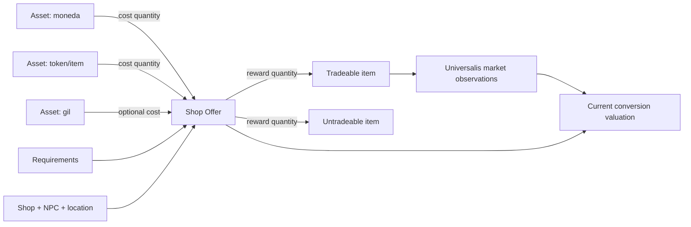

# Currency Exchange — especificación de dominio

Estado: diseño inicial  
Fecha: 2026-08-09  
Naturaleza: cálculo determinista, sin machine learning

## 1. Propósito

Mantener un catálogo versionado de todas las monedas e intercambios observables en los datos estáticos soportados de FFXIV y responder:

> Dada una moneda o token, ¿qué puedo comprar con ella, qué resultados se pueden vender en el Market Board y cuántos gil actuales devuelve cada unidad gastada?

El catálogo incluye también ofertas no monetizables para que ausencia de resultado y falta de cobertura no sean confundidas.

## 2. Definición de “todas”

“Todas” significa:

- Todas las fuentes de tiendas descubiertas en la versión global del juego soportada.
- Todas las filas de cada fuente, incluidas ofertas antiguas, ocultas o no tradeables cuando puedan interpretarse.
- Todas las monedas formales y todos los items usados como tokens de costo.
- Todas las ofertas de costo simple o compuesto.
- Toda recompensa directa, marketable o no.
- Todas las excepciones registradas de forma visible.

No significa afirmar que XIVAPI expone estado runtime o condiciones personales. Si una oferta depende de quest, reputación, rank, progreso, temporada o ubicación y el dato no está disponible o no es interpretable, la oferta permanece en el catálogo con `requirements_status=PARTIAL/UNKNOWN`.

La métrica de completitud se calcula contra filas fuente, no contra una lista manual de monedas conocidas.

## 3. Alcance funcional

### Incluido

- Búsqueda por nombre, alias o ID de moneda/token.
- Lista completa de ofertas que consumen ese activo.
- Vendor, shop y ubicación cuando estén disponibles.
- Costos, recompensas, cantidades y requisitos.
- Marketability de cada recompensa.
- Precio observado por world y Data Center.
- Gil bruto y neto por unidad de moneda.
- Velocidad reciente de venta y frescura como contexto, sin predicción.
- Diff entre versiones del juego.
- Cobertura y excepciones auditables.

### Fuera del primer release

- Predicción de precio futuro.
- Optimización de cómo farmear la moneda.
- Lectura automática del balance de monedas del personaje.
- Automatización de compras o ventas.
- Valorar de forma automática cadenas probabilísticas como desynthesis, coffers o lootboxes.
- Atribuir un valor individual arbitrario a cada moneda en una oferta con múltiples costos.

## 4. Modelo conceptual



### Asset

Unidad genérica que puede aparecer como costo o recompensa:

- `GIL`
- `CURRENCY`
- `ITEM_TOKEN`
- `ITEM`
- `EVENT_CURRENCY`
- `PSEUDO_CURRENCY`
- `UNKNOWN`

La clasificación es descriptiva; los cálculos dependen del ID y de la cantidad, no del nombre de la categoría.

### Currency

Vista de assets usados como medio de intercambio. Puede representar una entrada formal de moneda o un item-token. Contiene alias localizados y estado por versión.

### Shop

Fuente lógica de ofertas. Se conserva separada del NPC porque múltiples NPC pueden servir la misma tienda y un NPC puede servir varias.

### Offer

Intercambio atómico con N costos y M recompensas. Si una fila fuente contiene varias opciones, el adapter las expande a ofertas atómicas sin perder el row ID original.

### Requirement

Restricción conocida: quest, rank, reputación, job, nivel, progreso, ventana temporal, límite de compra u otra condición.

## 5. Modelo relacional

### `dim_asset`

```text
asset_key
asset_type
source_sheet
source_row_id
item_id nullable
canonical_name
name_en/name_ja/name_de/name_fr
icon_id
is_market_tradable nullable
valid_from_version
valid_to_version nullable
```

### `dim_currency`

```text
currency_key
asset_key
currency_family
is_legacy
is_capped nullable
cap_amount nullable
cap_period nullable
display_order nullable
```

### `dim_shop`

```text
shop_key
source_adapter
source_sheet
source_row_id
shop_name
valid_from_version
valid_to_version nullable
raw_hash
```

### `bridge_shop_location`

```text
snapshot_id
shop_id
location_index
npc_id
npc_name nullable
level_row_id
territory_id
map_id
map_asset_id nullable
place_name nullable
region_name nullable
world_x
world_y
world_z
map_x
map_y
marker_left_percent
marker_top_percent
confidence
```

Las relaciones directas `SpecialShop → ENpcBase → Level` usan confianza
`DIRECT_ENPC_LEVEL`. Las rutas resueltas a través de `PreHandler` o
`InclusionShop` usan `INCLUSION_SHOP_ENPC_LEVEL`. Los comerciantes de gemas
bicolores usan `FATE_SHOP_LEVEL`, o `CUSTOM_TALK_FATE_SHOP_LEVEL` para las
tiendas antiguas de Shadowbringers; si no existe ninguna ruta confiable, el
dashboard muestra explícitamente que la ubicación no está disponible.

### `dim_shop_offer`

```text
offer_key
shop_key
source_subrow_key
offer_index
version
is_active_known
parse_status
raw_hash
```

### `bridge_offer_cost`

```text
offer_key
cost_index
asset_key
quantity
quality_requirement nullable
```

### `bridge_offer_reward`

```text
offer_key
reward_index
asset_key
quantity
is_hq nullable
```

### `bridge_offer_requirement`

```text
offer_key
requirement_type
operator
requirement_value
human_description
parse_confidence
```

### `currency_market_valuation`

```text
valuation_id
offer_key
queried_currency_key
reward_asset_key
world_or_dc
price_basis
market_unit_price
output_quantity
queried_currency_quantity
other_costs_json
gross_gil_per_currency nullable
net_gil_per_currency nullable
sale_velocity
market_data_as_of
catalog_version
valuation_status
```

### `shop_coverage_audit`

```text
audit_run_id
game_version
source_sheet
adapter_version
source_rows
offers_emitted
rows_ignored
rows_failed
unknown_assets
unknown_requirements
started_at
completed_at
```

## 6. Descubrimiento y adapters

No se mantiene sólo una lista fija de monedas. Se mantiene un registry de fuentes de tiendas.

Fuentes iniciales a investigar y clasificar incluyen familias como:

- `SpecialShop`
- `GCScripShopItem` / `GCShop`
- `InclusionShop`
- `CollectablesShop`
- `FccShop`
- `DisposalShop`
- `LotteryExchangeShop`
- `TomestoneConvert`
- `GilShop`
- Cualquier nueva sheet que aparezca y contenga costos/recompensas de tienda

Cada adapter implementa:

```text
discover(version) -> SourceInventory
extract(version, cursor) -> RawRows
parse(raw_row) -> ParsedOffer[] | ClassifiedException
validate(parsed_offer) -> ValidationResult
```

El registry indica por sheet:

- `SUPPORTED`
- `IRRELEVANT`
- `EMPTY`
- `PENDING_RESEARCH`
- `SCHEMA_BLOCKED`

Ninguna fila desaparece silenciosamente. Toda fila termina como oferta, ignored con reason code o excepción investigable.

### Regla validada para `SpecialShop`

El item de costo crudo no siempre es el item real. El adapter conserva ambos valores y resuelve el canónico mediante:

- `UseCurrencyType` de la tienda.
- El lookup versionado de `TomestonesItem`.
- Una tabla explícita de placeholders históricos.
- Excepciones documentadas por `SpecialShop.RowId`.

`CostType` no se usa para escoger la moneda; por ejemplo, el valor `1` representa HQ en el resolvedor validado. Cada cambio de estas reglas exige fixtures y snapshot tests del parche correspondiente.

## 7. Pipeline

```text
snapshot estático versionado (sqpack local o XIVAPI pin)
    ↓
source discovery
    ↓
raw shop rows (Bronze)
    ↓
adapter-specific parsing
    ↓
generic offers (Silver)
    ↓
asset and requirement resolution
    ↓
marketability join
    ↓
Universalis market join
    ↓
current valuations (Gold)
```

### Frecuencias

- Catálogo de tiendas: al detectar una versión nueva y una verificación diaria ligera.
- Catálogo de assets/marketability: al cambiar versión.
- Valuations: junto con el refresh de datos de mercado.
- Top conversions visibles: 10–30 minutos en patch-day; 1–6 horas normalmente.

El catálogo es estático entre versiones; sólo la valoración de mercado necesita refresco frecuente.

## 8. Cálculos

### Oferta con una moneda y un producto

```text
gross_total_gil = observed_market_unit_price × reward_quantity
gross_gil_per_currency = gross_total_gil / currency_quantity
```

```text
net_total_gil = gross_total_gil - configured_market_fees - explicit_gil_cost
net_gil_per_currency = net_total_gil / currency_quantity
```

El fee se configura y se muestra; no queda escondido dentro del precio.

### Oferta con una moneda y varios productos

Se calcula el valor de cada producto marketable y el total de la canasta. Los productos no tradeables aportan cero sólo al indicador `direct_mb_gil`; no se declara que carezcan de utilidad.

### Oferta con múltiples costos

Ejemplo conceptual: `10 moneda A + 2 token B + 1.000 gil`.

Resultados válidos:

- Valor total de la recompensa.
- Canasta exacta de costos.
- Valor neto después del costo en gil.
- Valor residual por A sólo si B tiene una valoración seleccionada explícitamente.

Resultado prohibido por defecto:

- Dividir todo el valor por 10 y llamarlo “gil por A”, ignorando B.

### Bases de precio

- `MIN_LISTING`: precio mínimo observado ahora.
- `MEDIAN_LISTING`: mediana de listings observados.
- `RECENT_AVG_SALE`: promedio reciente de ventas.

Las conversiones productivas usan `MIN_LISTING` en todos los casos. La UI siempre muestra cuál se usó y conserva las otras métricas sólo para análisis; no se denomina “precio esperado”.

### Confianza de datos

La valoración se etiqueta:

- `FRESH`: dentro de la ventana configurada.
- `STALE`: dato antiguo; se muestra con advertencia.
- `NO_MARKET_DATA`: tradeable sin observación disponible.
- `NOT_TRADEABLE`: no vendible en MB.
- `MIXED_COST_UNVALUED`: costos múltiples sin valoración residual.
- `PARSE_INCOMPLETE`: oferta o requisitos incompletos.

## 9. Respuesta de consulta

Una búsqueda de moneda devuelve:

```json
{
  "currency": {
    "id": "...",
    "name": "...",
    "family": "...",
    "legacy": false
  },
  "scope": "DATA_CENTER",
  "market_data_as_of": "...",
  "offers": [
    {
      "shop": "...",
      "location": "...",
      "costs": [{"asset": "...", "quantity": 1}],
      "reward": {"item_id": 0, "name": "...", "quantity": 1},
      "marketability": "DIRECT_MB",
      "prices": {
        "min_listing": 0,
        "median_listing": 0,
        "recent_avg_sale": 0
      },
      "net_gil_per_currency": 0,
      "sale_velocity": 0,
      "requirements": [],
      "freshness": "FRESH"
    }
  ]
}
```

Orden por defecto:

1. `DIRECT_MB` con datos frescos.
2. Mayor `net_gil_per_currency`.
3. Mayor velocidad de venta.
4. Mejor completitud de requisitos.

La velocidad sólo informa liquidez; no convierte el cálculo en una predicción.

## 10. API

### `GET /currencies/search?q={text}`

Busca monedas formales, tokens, aliases y nombres localizados.

### `GET /currencies/{currency_key}/offers`

Filtros:

- `world_or_dc`
- `marketable`
- `price_basis`
- `include_legacy`
- `include_untradeable`
- `freshness_max_age`

### `GET /currencies/{currency_key}/best-conversions`

Vista ordenada y acotada para uso diario.

### `GET /shops/{shop_key}`

Tienda, ubicación, ofertas, requisitos y fuente.

### `GET /shops/coverage`

Cobertura por versión/sheet y excepciones pendientes.

### `GET /versions/{version}/shop-diff`

Monedas, ofertas, costos, recompensas o requisitos agregados/cambiados/eliminados.

## 11. UI y Google Sheets

### Dashboard

Pantalla `Currency Converter`:

- Autocomplete de moneda.
- Toggle current/legacy.
- World/DC y base de precio.
- Tabla de todas las ofertas.
- Filtros tradeable, frescura, requisitos y vendor.
- Explicación de costos mixtos.
- Link a detalle del item y shop.

Pantalla `Coverage`:

- Versión soportada.
- Sheets descubiertas.
- Filas totales/procesadas/ignoradas/fallidas.
- Unknown assets y requisitos.
- Diff desde la versión anterior.

### Google Sheets

`CURRENCY_CONVERTER` contiene sólo una selección consultable/publicable:

```text
currency
reward_item
shop
location
cost
reward_quantity
market_price_basis
market_price
net_gil_per_currency
sale_velocity
marketable
requirements_summary
data_as_of
```

`SHOP_COVERAGE` expone métricas de completitud y excepciones, no todo el dataset crudo.

## 12. Controles de calidad

### Invariantes por oferta

- Al menos un costo positivo.
- Al menos una recompensa positiva.
- Cantidades enteras positivas salvo excepción documentada.
- Assets resueltos o marcados `UNKNOWN`.
- Fuente, versión, row y subrow preservados.
- No duplicar ofertas equivalentes del mismo shop/version.

### Invariantes de valoración

- Sólo `DIRECT_MB` recibe precio de Market Board.
- `market_data_as_of` nunca puede ser posterior al job de valoración.
- Divisor de moneda mayor que cero.
- Costos mixtos no producen valor unitario simple sin método explícito.
- Todo resultado conserva price basis, scope y fee usados.

### Tests

- Golden fixtures por tipo de shop.
- Property tests para expansión N-cost/M-reward.
- Tests de cantidades, HQ y marketability.
- Tests de diff entre versiones.
- Snapshot tests de adapters.
- Contract tests contra schemas pineados.
- Reconciliación de conteos fuente → resultado.

## 13. Definition of Done

El módulo está listo para una versión del juego cuando:

1. El inventario de fuentes fue ejecutado y guardado.
2. Cada source sheet tiene estado y owner lógico.
3. El 100% de filas tiene resultado: offer, ignored con razón o exception.
4. Cero fallos silenciosos.
5. Las excepciones se muestran en Coverage.
6. Todas las ofertas preservan trazabilidad a fuente y versión.
7. Todos los rewards se cruzan con marketability.
8. Todas las conversiones directas tradeables muestran precios actuales o `NO_MARKET_DATA`.
9. Los costos múltiples se presentan sin atribuciones engañosas.
10. El diff contra la versión anterior fue revisado.

## 14. Extensiones posteriores

- Rutas indirectas deterministas: moneda → item → craft conocido → Market Board.
- Desynthesis con probabilidades conocidas y valor esperado claramente etiquetado.
- Optimización de gasto para un balance dado de varias monedas.
- Alertas cuando cambia la mejor conversión de una moneda.
- Historial de `gil por moneda` para observar tendencias sin llamarlas predicciones.
- Fuentes manuales versionadas para excepciones no representadas en datos estáticos.
